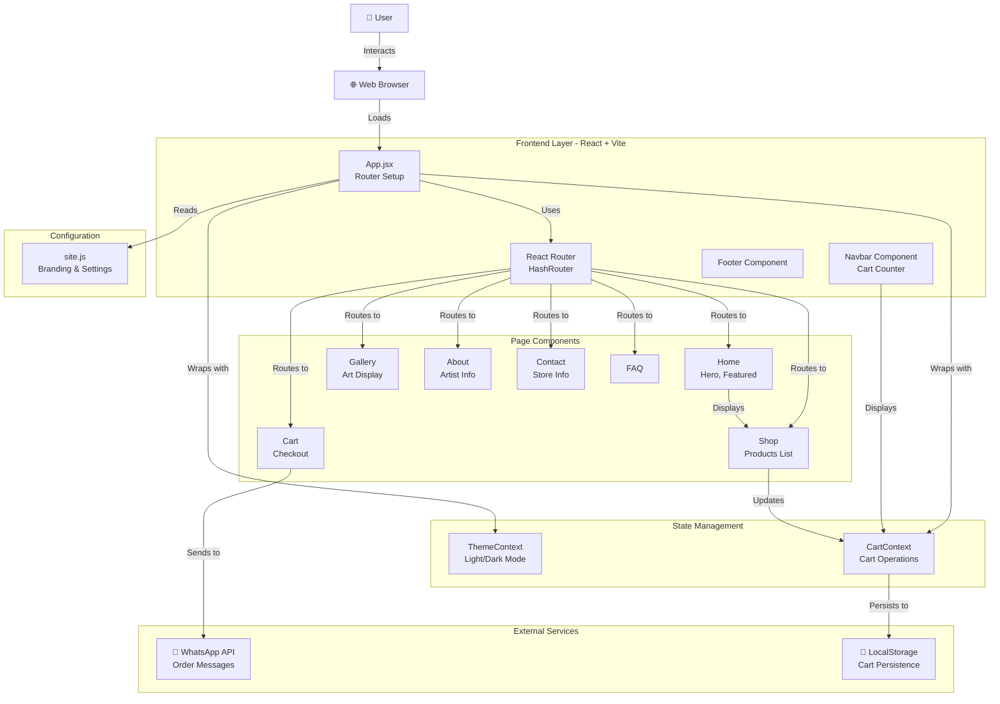
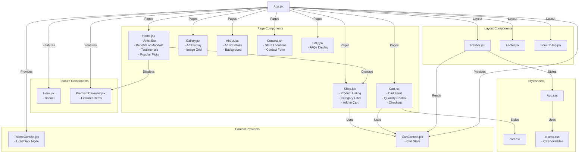
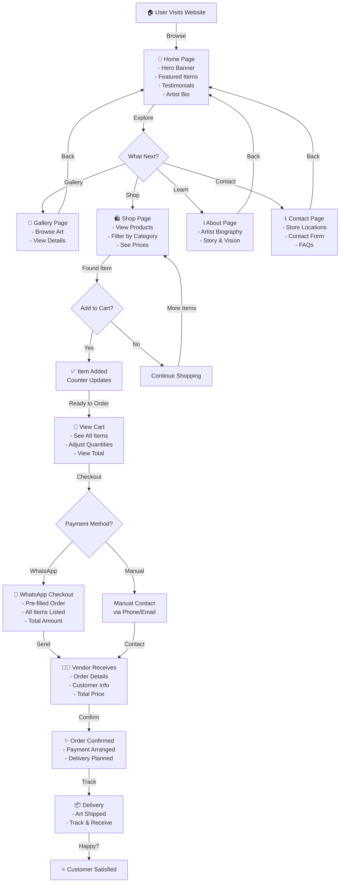
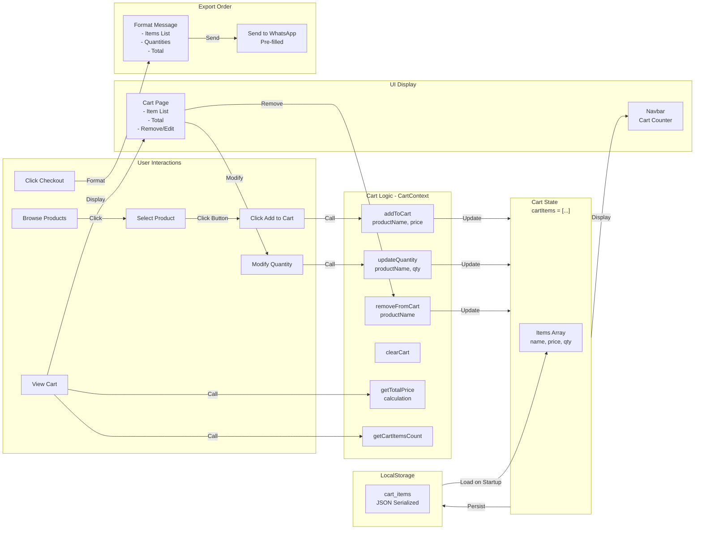

# 🎨 Geetha's Art Gallery

A beautiful, modern React-based e-commerce web application for showcasing and selling handcrafted Mandala art and related products. This project combines artistic beauty with seamless shopping functionality and WhatsApp integration for order management.

---

## 📋 Table of Contents

- [Overview](#overview)
- [Features](#features)
- [Technology Stack](#technology-stack)
- [Project Architecture](#project-architecture)
- [Component Structure](#component-structure)
- [User Journey](#user-journey)
- [Cart System](#cart-system)
- [File Structure](#file-structure)
- [Installation and Setup](#installation-and-setup)
- [Configuration](#configuration)
- [Features in Detail](#features-in-detail)
- [Available Routes](#available-routes)
- [Context Providers](#context-providers)
- [Deployment](#deployment)
- [Contributing](#contributing)

---

## 🌟 Overview {#overview}

Geetha's Art Gallery is a professional e-commerce platform dedicated to showcasing the intricate Mandala artwork of **Geeta Bhat**, a self-taught artist from Karnataka, India. The platform serves art enthusiasts globally while maintaining a strong connection to local communities through physical store locations.

**Key Focus:**

- **Mandala Art**: Hand-drawn, intricate geometric designs
- **Custom Orders**: Personalized artworks and decor items
- **E-Commerce**: Full shopping cart with WhatsApp integration
- **Multi-Language**: English and Kannada support
- **Accessibility**: Dark/Light theme support for user comfort

---

## ✨ Features {#features}

### Core Features

- ✅ **Responsive Design** - Mobile-first, works on all devices
- ✅ **Shopping Cart** - Add/remove items, adjust quantities
- ✅ **WhatsApp Integration** - One-click ordering via WhatsApp
- ✅ **Cart Persistence** - Local storage saves cart across sessions
- ✅ **Dark/Light Theme** - User preference saved automatically
- ✅ **Product Categories** - Filter and browse by category
- ✅ **Multiple Pages** - Home, Shop, Gallery, About, Contact, FAQ
- ✅ **Store Locations** - Multiple physical store details with maps
- ✅ **Testimonials** - Customer reviews and social proof
- ✅ **Featured Products** - Premium carousel on home page

### E-Commerce Features

- Product listing with images and prices
- Add to cart with visual feedback
- Cart item counter in navbar
- Quantity controls (increase/decrease)
- Total price calculation
- Remove items from cart
- Clear entire cart
- Formatted WhatsApp order messages

### User Experience

- Smooth page transitions
- Scroll-to-top functionality
- Toast notifications
- Mobile-optimized navigation menu
- SEO-friendly URLs (hash routing)
- Accessible color schemes

---

## 🛠️ Technology Stack {#technology-stack}

### Frontend

- **React 19.2.5** - UI framework
- **Vite 5.0.8** - Build tool & dev server
- **React Router 7.14.1** - Client-side routing
- **Lucide React 1.8.0** - Icon library

### Styling

- **CSS3** - Modern CSS with custom properties
- **CSS Variables** - Theme tokens for consistency
- **Responsive Design** - Mobile-first approach

### Build & Deployment

- **Vite Config** - Optimized build configuration
- **Vercel** - Deployment platform (vercel.json included)
- **NPM** - Package management

### Data Management

- **Context API** - State management
- **Local Storage** - Cart persistence
- **JSON** - Data serialization

---

## 📊 Project Architecture {#project-architecture}



---

## 🏗️ Component Structure {#component-structure}



---

## 👥 User Journey {#user-journey}



---

## 🛒 Cart System {#cart-system}



---

## 📁 File Structure {#file-structure}

```text
Geetha_Artgallary/
├── public/                          # Static assets
│   ├── gallery/                     # Gallery images
│   └── img/                         # Product images
│
├── src/                             # Source code
│   ├── components/                  # React components
│   │   ├── About.jsx               # About page
│   │   ├── Cart.jsx                # Shopping cart page
│   │   ├── Contact.jsx             # Contact page with store locations
│   │   ├── FAQ.jsx                 # FAQ section
│   │   ├── Footer.jsx              # Footer component
│   │   ├── Gallery.jsx             # Art gallery display
│   │   ├── Hero.jsx                # Hero banner
│   │   ├── Home.jsx                # Home page with featured products
│   │   ├── Navbar.jsx              # Navigation bar
│   │   ├── PremiumCarousel.jsx     # Featured items carousel
│   │   ├── ScrollToTop.jsx         # Scroll to top button
│   │   and Shop.jsx                # Product shop page
│   │
│   ├── context/                     # Context providers (state management)
│   │   ├── CartContext.jsx         # Shopping cart state
│   │   └── ThemeContext.jsx        # Light/Dark theme state
│   │
│   ├── config/                      # Configuration files
│   │   └── site.js                 # Site settings, store locations, social links
│   │
│   ├── styles/                      # CSS stylesheets
│   │   ├── cart.css                # Cart page styles
│   │   ├── tokens.css              # CSS variables and design tokens
│   │   └── App.css                 # Global styles
│   │
│   ├── App.jsx                      # Main app component with routing
│   ├── App.css                      # Main app styles
│   └── main.jsx                     # App entry point
│
├── index.html                       # HTML entry point
├── package.json                     # Project dependencies
├── vite.config.js                   # Vite build configuration
├── vercel.json                      # Vercel deployment config
└── README.md                        # This file
```

---

## 🚀 Installation and Setup {#installation-and-setup}

### Prerequisites

- Node.js (v14 or higher)
- npm or yarn package manager
- Git (optional)

### Steps

1. **Clone the repository**

   ```bash
   git clone https://github.com/ChandanHegde24/Geetha_Artgallary.git
   cd Geetha_Artgallary
   ```

2. **Install dependencies**

   ```bash
   npm install
   ```

3. **Start development server**

   ```bash
   npm run dev
   ```

   The app will be available at `http://localhost:5173`

4. **Build for production**

   ```bash
   npm run build
   ```

5. **Preview production build**

   ```bash
   npm run preview
   ```

---

## ⚙️ Configuration {#configuration}

### Site Configuration (`src/config/site.js`)

Configure the following settings:

```javascript
export const SITE = {
  brandName: "Geeta's Art Gallery",           // Website name
  whatsappNumber: "918217416352",             // WhatsApp Business number
  socialLinks: {
    instagram: "https://...",                 // Instagram profile
    facebook: "https://...",                  // Facebook page
    youtube: "https://...",                   // YouTube channel
  },
  storeLocations: [
    {
      id: 1,
      name: "Store - Kumuta",
      address: "...",
      phone: "+91 ...",
      lat: 14.4203,
      lng: 74.6652,
      hours: "Mon-Friday: 9.00AM-6.00PM",
      type: "store",
      googleMapsUrl: "...",
    },
    // ... more locations
  ],
};
```

### Theme Configuration

The theme system uses CSS variables defined in `src/styles/tokens.css`. Modify colors, fonts, and sizing here.

**Light Mode Colors:**

- Primary: Golden tones
- Background: Light colors
- Text: Dark colors

**Dark Mode Colors:**

- Primary: Bright golden
- Background: Dark colors
- Text: Light colors

---

## 🎯 Features in Detail {#features-in-detail}

### 1. Shopping Cart System

- **Add to Cart**: Click "Add to Cart" button on any product
- **View Cart**: Navigate to `/cart` or click cart icon
- **Adjust Quantity**: Use +/- buttons in cart
- **Remove Items**: Click remove button for individual items
- **Persistent Storage**: Cart saved in browser's local storage

### 2. WhatsApp Integration

- Pre-filled order message with all items
- Includes product names, quantities, and prices
- Automatic total calculation
- One-click checkout via WhatsApp

### 3. Theme Support

- Toggle between light and dark modes
- User preference saved in local storage
- System-wide theme application
- Smooth theme transitions

### 4. Product Management

- Product listing with images and prices
- Category filtering
- Product search capability
- Featured products showcase
- New arrivals carousel

### 5. Multi-Page Experience

- Home page with artist bio
- Gallery page for browsing artwork
- Shop page with product catalog
- About page with artist details
- Contact page with store locations and maps
- FAQ page with customer questions

### 6. Responsive Design

- Mobile-first approach
- Tablet optimization
- Desktop layout
- Touch-friendly navigation
- Adaptive images

---

## 🗺️ Available Routes {#available-routes}

| Route       | Component      | Purpose                             |
| ----------- | -------------- | ----------------------------------- |
| `/`         | Home           | Landing page with featured products |
| `/about`    | About          | Artist biography and background     |
| `/gallery`  | Gallery        | Art gallery display                 |
| `/shop`     | Shop           | Full product catalog                |
| `/cart`     | Cart           | Shopping cart and checkout          |
| `/contact`  | Contact + FAQ  | Store locations and contact form    |
| `*`         | Redirect       | Redirect unknown routes to home     |

---

## 🔄 Context Providers {#context-providers}

### CartContext (`src/context/CartContext.jsx`)

**Methods:**

- `addToCart(product)` - Add item to cart
- `removeFromCart(productName)` - Remove item
- `updateQuantity(productName, quantity)` - Update item quantity
- `clearCart()` - Clear all items
- `getTotalPrice()` - Get total amount
- `getCartItemsCount()` - Get number of items

**State:**

```javascript
{
  cartItems: [
    {
      name: "Product Name",
      price: 1500,
      quantity: 2,
      image: "/img/product.jpg"
    },
    // ... more items
  ]
}
```

### ThemeContext (`src/context/ThemeContext.jsx`)

**Methods:**

- `toggleTheme()` - Toggle between light and dark mode
- `isDark` - Check if dark mode is active

**Saved in:** `localStorage['theme']`

---

## 📦 Dependencies

### Core Dependencies

- **react** (19.2.5) - UI framework
- **react-dom** (19.2.5) - React DOM rendering
- **react-router-dom** (7.14.1) - Client-side routing
- **lucide-react** (1.8.0) - Icon library

### Dev Dependencies

- **@vitejs/plugin-react** (4.2.1) - React support for Vite
- **vite** (5.0.8) - Build tool

---

## 🌐 Deployment {#deployment}

### Vercel (Recommended)

The project is configured for Vercel deployment via `vercel.json`.

1. **Connect repository to Vercel**

   ```bash
   npm i -g vercel
   vercel
   ```

2. **Deploy**

   ```bash
   vercel --prod
   ```

3. **Environment Variables** (if needed)

   - Add via Vercel dashboard

### Other Platforms

**Netlify:**

1. Build: `npm run build`
2. Publish: `dist` folder

**GitHub Pages:**

1. Update vite.config.js with base path
2. Build and push to gh-pages branch

---

## 🔧 Development Tips

### Adding New Products

Edit `src/components/Shop.jsx` and update the `products` array:

```javascript
const products = [
  {
    name: "Product Name",
    price: "₹ X,XXX.00",
    eta: "Ready to order / Customizable",
    category: "Category Name",
    image: "/img/product.jpg",
  },
  // ... more products
];
```

### Creating New Pages

1. Create component in `src/components/`
2. Add route in `src/App.jsx`
3. Add navigation link in `src/components/Navbar.jsx`

### Customizing Styles

- Global styles: `src/App.css`
- Theme tokens: `src/styles/tokens.css`
- Cart styles: `src/styles/cart.css`

---

## 🤝 Contributing {#contributing}

Contributions are welcome! Please follow these steps:

1. Fork the repository
2. Create a feature branch (`git checkout -b feature/AmazingFeature`)
3. Commit changes (`git commit -m 'Add some AmazingFeature'`)
4. Push to branch (`git push origin feature/AmazingFeature`)
5. Open a Pull Request

---

## 📞 Support & Contact

- **WhatsApp:** +91 82174 16352
- **Instagram:** [@geetas_art_gallery](https://www.instagram.com/geetas_art_gallery)
- **YouTube:** [@geetasartgallery](https://www.youtube.com/@geetasartgallery)

---

## 📄 License

This project is licensed under the MIT License - see LICENSE file for details.

---

## 🙏 Acknowledgments

- **Artist:** Geeta Bhat - Creator of beautiful Mandala artwork
- **Framework:** React and Vite for powerful development tools
- **Icons:** Lucide React for beautiful icon set
- **Community:** Thanks to all contributors and supporters

---

**Last Updated:** April 2026  
**Version:** 1.0.0  
**Status:** Active Development
